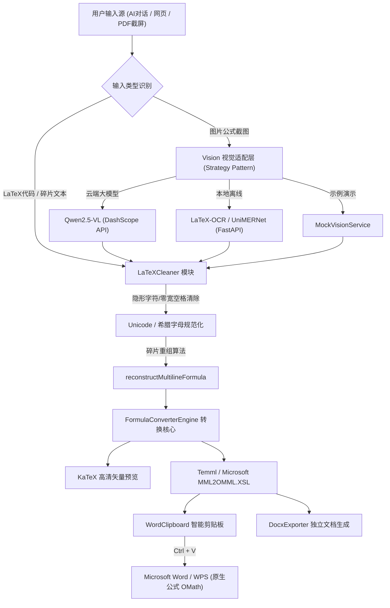

# 📐 LLMtoWord (AI 数学公式转 Word 中间件)

> **告别格式错乱！一键将 AI 对话公式、PDF 碎片文本与截图无缝转换为 Microsoft Word 原生可编辑公式对象。**  
> *Zero-plugin middleware: Convert AI dialogues, LaTeX & formula screenshots directly into native Microsoft Word equations (OMML / MathML).*

<p align="center">
  
  
  
  
  
  
</p>

<p align="center">
  <a href="./README.md"><b>简体中文</b></a> · <a href="./README_EN.md">English</a>
</p>

---

## 💡 为什么需要 LLMtoWord？（解决真实痛点）

在学术研究、论文写作与工程报告场景中，大部分人每天都会遇到以下两个崩溃瞬间：

1. **AI 对话公式复制灾难**：  
   从 ChatGPT、DeepSeek、Claude、Kimi 对话中复制 LaTeX 数学公式到 Microsoft Word 时，Word 默认将其当作普通文字，或是粗暴剔除标签，结果分数变成挤在一起的一行乱码（如 `ECsoil-EClimitEClimit`），角标与除线全部丢失。
2. **PDF / 论文划词复制撕裂**：  
   从 PDF 课件或论文中直接划选公式文字时，由于 PDF 底层是 2D 画布坐标排版，复制出来的文本会**完全丧失分数线，上下角标全部垂直散落错位**（例如把 $\frac{(a)_n(b)_n}{(c)_n}$ 拆成散乱上下两行）。
3. **商业工具昂贵繁琐**：  
   Mathpix 订阅昂贵且有次数限制；Pandoc 命令行配置极其繁琐，无法做到“复制即用”。

**LLMtoWord 诞生于此** —— 纯前端、零插件、开箱即用，通过微软原生 MathML 注入机制，在 Word 中只需 **Ctrl + V** 即可瞬间生成原生、高清、矢量、完全可编辑的数学公式！

---

## ✨ 核心特性

- 🚀 **Word 原生公式零插件直通**：
  基于微软官方 Office Math 规范（MathML / OMML），无需安装 MathType 或任何第三方插件，复制后在 Word (2016、2019、2021、Office 365 及 WPS) 中直接按 `Ctrl + V` 即可瞬间生成原生可编辑公式。
- 🧠 **启发式多行碎片公式重组引擎**：
  独创的多行几何启发式算法，自动修复从 PDF 划选复制时**断行、散落上下标、丢失分数线**的碎片公式（如高斯超几何函数 ${}_2F_1$、柯西高阶导数积分公式等）。
- 👁️ **多模态公式视觉识别（双轨制架构）**：
  - **云端大模型模式**：支持配置阿里云通义千问 `Qwen2.5-VL` 多模态模型，截屏按 `Ctrl+V` 一键识图；
  - **本地离线 Sidecar 模式**：配套提供基于开源 **`LaTeX-OCR (pix2tex)`** 的超轻量 Python 微服务（仅 ~110MB 权重，纯 CPU 笔记本 0.2 秒极速出结果，断网保密运行）。
- 🛡️ **100% 客户端本地隐私保护**：
  核心解析、清洗与 OMML 转换逻辑全部在浏览器本地内存运行，公式数据绝对不上传任何第三方服务器，保护学术科研隐私。
- 📑 **独立 Word (.docx) 文档导出**：
  内置轻量级 OpenXML 文档生成器，可直接将公式打包导出为独立的 `.docx` 格式文档。
- 🧪 **全量单元测试与基准评测**：
  涵盖 215 种数学符号与 106 种复杂矩阵、分式、微积分结构的自动化测试套件，转换准确率达 100%。

---

## 🏗️ 系统技术架构



---

## 🚀 快速开始

### 1. Web 前端启动

```bash
# 克隆仓库
git clone https://github.com/your-username/LLMtoWord.git
cd LLMtoWord

# 安装依赖
npm install

# 启动开发服务器
npm run dev

# 运行自动化测试
npm test
```

浏览器打开 `http://localhost:5173` 即可立即使用。

---

### 2. （可选）启动本地离线 OCR 微服务

若希望在断网内网环境下实现**零成本、纯本地、CPU 秒级图片公式识别**：

```bash
cd backend

# Windows 一键启动
start.bat

# macOS / Linux 启动
pip install -r requirements.txt
python app.py
```

服务就绪后会监听 `http://127.0.0.1:8000`，前端 Web 界面会自动检测并切换为本地推理模式。

---

## 💼 简历与技术面试亮点 (Interview Highlights)

如果你将本项目作为个人代表作写入简历，以下是推荐的技术亮点表述与架构设计思路：

1. **深入 Office 剪贴板底层机制**：
   - 逆向分析了 Word 的 HTML 导入过滤器规则，解决了 Word 在解析 `text/html` 时粗暴剥离 `<m:oMath>` 导致公式被摊平成无格式文字的陷阱；
   - 采用标准 MathML XML 注入与纯文本优先级匹配，攻克了免插件生成原生 Office Math 对象的兼容性瓶颈。
2. **多模态视觉混合架构（策略模式）**：
   - 设计了松耦合的 `IQwenVisionService` 接口，解耦前端与视觉推理实现；
   - 既支持基于标准 OpenAI/DashScope 规范的云端大模型调用，又提供基于 Python FastAPI + `LaTeX-OCR (pix2tex)` 的轻量化本地 Sidecar 进程，支持实时探活与无缝降级。
3. **抗噪容错与文本重构算法**：
   - 针对 PDF 划词复制导致的 2D $\to$ 1D 降维信息丢失问题，自主设计了基于上下文正则与数学语法的多行重构算法；
   - 解决了从网页/PDF 复制时混入的隐藏 `\u200B`（零宽空格）等不可见字符对语法解析器的干扰。

---

## 🛠️ 技术栈

- **前端核心**：React 19、TypeScript 5.9、Vite 8、TailwindCSS v4
- **数学解析与渲染**：KaTeX、Temml、XSLTProcessor (微软 MML2OMML)
- **文档与剪贴板**：docx.js、Async Clipboard API
- **AI 视觉与本地服务**：FastAPI、Python 3.11、pix2tex (LaTeX-OCR)、UniMERNet、Qwen-VL
- **自动化测试**：Vitest 5、jsdom、Word COM 自动化脚本

---

## 📄 开源许可证

本项目基于 [MIT License](LICENSE) 开源发布，欢迎自由使用、修改与衍生开发。

⭐ **如果这个项目解决了您的公式排版痛点，欢迎在 GitHub 上点个 Star 支持一下！**
