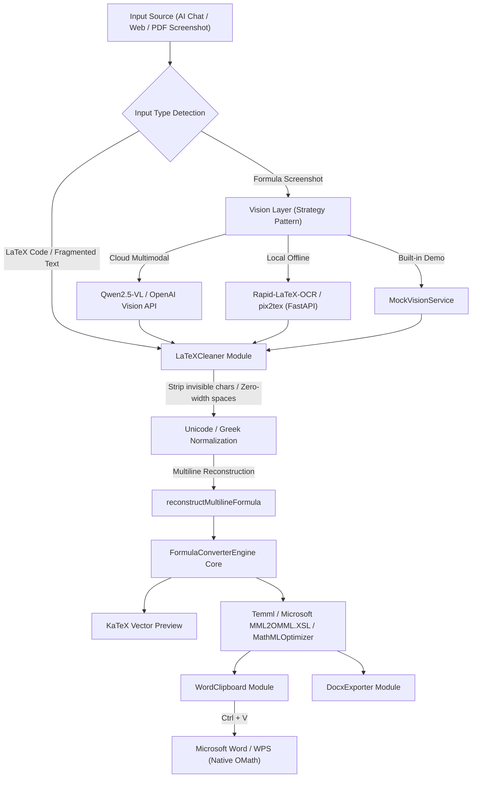

# 📐 LLMtoWord (AI LaTeX to Word Equation Middleware)

> **Say goodbye to broken math formatting! Seamlessly convert AI dialogues, fragmented PDF text, and formula screenshots into native, fully editable Microsoft Word equation objects.**  
> *Zero-plugin middleware: Convert AI dialogues, LaTeX & formula screenshots directly into native Microsoft Word equations (OMML / MathML).*

<p align="center">
  
  
  
  
  
  
</p>

<p align="center">
  <a href="./README.md">简体中文</a> · <a href="./README_EN.md"><b>English</b></a>
</p>

---

## 💡 Why LLMtoWord? (Solving Real-world Pain Points)

In academic research, thesis writing, and technical reporting, most researchers and students encounter these frustrating moments daily:

1. **AI Chat Formula Copy Disasters**:  
   When copying LaTeX math from ChatGPT, DeepSeek, Claude, or Kimi into Microsoft Word, Word defaults to treating it as plain text or strips formatting tags, collapsing fractions into broken single-line text (e.g. `ECsoil-EClimitEClimit`), losing all subscripts and fraction bars.
2. **PDF Text Selection Fragmentation**:  
   When copying equations directly from PDF slides or papers, because PDFs render text via 2D coordinate layouts, copied text **completely loses horizontal fraction bars, and vertical indices scatter across multiple lines** (e.g. scattering $\frac{(a)_n(b)_n}{(c)_n}$ into separate lines).
3. **Expensive and Cumbersome Commercial Alternatives**:  
   Mathpix subscriptions are expensive with monthly quota caps; Pandoc CLI setup is overly complex and cannot offer instant "copy-and-paste" convenience.

**LLMtoWord was born to solve this** — pure client-side, zero plugins, out-of-the-box ready. Through Microsoft's native MathML clipboard injection mechanism, simply press **Ctrl + V** in Word to instantly generate native, crisp, vector, fully editable math equation objects!

---

## ✨ Key Features

- 🚀 **Zero-Plugin Direct Word Equation Pasting**:  
  Built upon Microsoft's official Office Math standard (MathML / OMML). No need for MathType or third-party add-ins. Simply press `Ctrl + V` in Word (2016, 2019, 2021, Office 365, and WPS) to instantly create native editable equations.
- 🧠 **Heuristic Multi-line Formula Reconstruction**:  
  Proprietary multi-line geometric reconstruction algorithm automatically repairs fragmented math copied from PDFs with **broken lines, scattered sub/superscripts, and missing fraction lines** (e.g. Gauss hypergeometric series ${}_2F_1$, Cauchy integral formulas).
- 👁️ **Multimodal Formula Vision OCR (Dual-Track Architecture)**:  
  - **Cloud Multimodal Mode**: Supports Alibaba Qwen2.5-VL and OpenAI-compatible vision APIs. Paste screenshots with `Ctrl + V` for one-click OCR.
  - **Local Offline Sidecar Mode**: Bundles a lightweight Python service based on **`Rapid-LaTeX-OCR (ONNX CPU)` / `pix2tex`** (~110MB weights, ~0.2s CPU inference, 100% offline, privacy-safe, zero API key required).
- 🛡️ **100% Client-Side Privacy Protection**:  
  Core parsing, cleaning, and OMML conversion logic run 100% inside your browser's local memory. Formula text is never uploaded to any server.
- 📑 **Standalone Word (.docx) Export**:  
  Built-in lightweight OpenXML generator packages equations directly into downloadable `.docx` files.
- 🧪 **Full Test Suite & Benchmark**:  
  Comprehensive test suites covering 215 mathematical symbols and 106 complex matrix/fraction/calculus structures with a 100% pass rate.

---

## 🏗️ Architecture



---

## 🚀 Quick Start

### 1. Web Frontend

```bash
# Clone the repository
git clone https://github.com/your-username/LLMtoWord.git
cd LLMtoWord

# Install dependencies
npm install

# Start development server
npm run dev

# Run unit tests
npm test
```

Open `http://localhost:5173` in your browser to start using immediately.

---

### 2. (Optional) Start Local Offline OCR Sidecar

For 100% private, offline, zero-cost, CPU-based formula screenshot recognition without any API keys:

```bash
cd backend

# Windows (One-click batch runner)
start.bat

# macOS / Linux
pip install -r requirements.txt
python app.py
```

The service listens on `http://127.0.0.1:8000`. The web app automatically probes and switches to local mode.

---

## 🔬 Technical Innovations & Engineering Highlights

LLMtoWord is engineered to solve complex interoperability and rendering challenges across platforms:

1. **Deep Office Clipboard Protocol Reverse-Engineering**:  
   - Analyzed Word and WPS clipboard parsing pipelines, eliminating the issue where Word's HTML sanitizer stripped mathematical markup into plain text.
   - Built a dedicated `MathMLOptimizer` compatibility layer that fixes native Word quirks, such as floating diacritic accents (`m:acc` vs `m:limUpp`) and dotted placeholder boxes (`⬚`) caused by empty operands in n-ary integral operators.
2. **Hybrid Cloud/Edge Multimodal Vision Architecture**:  
   - Implemented a unified Strategy Pattern for vision inference, decoupling UI components from backend engines.
   - Supports both cloud multimodal vision LLMs (Qwen-VL) and a lightweight ONNX CPU-optimized local Sidecar (~110MB weights, ~0.2s CPU inference, 100% offline & privacy-safe).
3. **Fault-Tolerant Math Reconstruction & De-noising Pipeline**:  
   - Formulated a heuristic multi-line syntax reconstructor to recover 2D math structures (fractions, sub/superscripts) broken by 1D PDF text copying.
   - Globally purges invisible zero-width characters (e.g. `\u200B`) and normalizes irregular Unicode notations to guarantee parser stability.

---

## 🛠️ Tech Stack

- **Frontend Core**: React 19, TypeScript 5.9, Vite 8, TailwindCSS v4
- **Math Parsing & Rendering**: KaTeX, Temml, XSLTProcessor (Microsoft MML2OMML)
- **Document & Clipboard**: docx.js, Async Clipboard API
- **AI Vision & Sidecar**: FastAPI, Python 3.11, Rapid-LaTeX-OCR (ONNX), pix2tex, Qwen-VL
- **Testing & CI/CD**: Vitest 5, jsdom, GitHub Actions (GitHub Pages)

---

## 📄 License

This project is licensed under the [MIT License](LICENSE) — free for personal, academic, and commercial use.

⭐ **If this project saved you time and formatting headaches, please consider giving it a Star on GitHub!**
